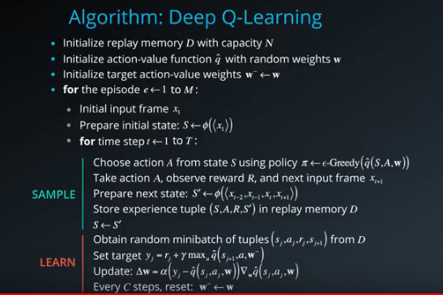
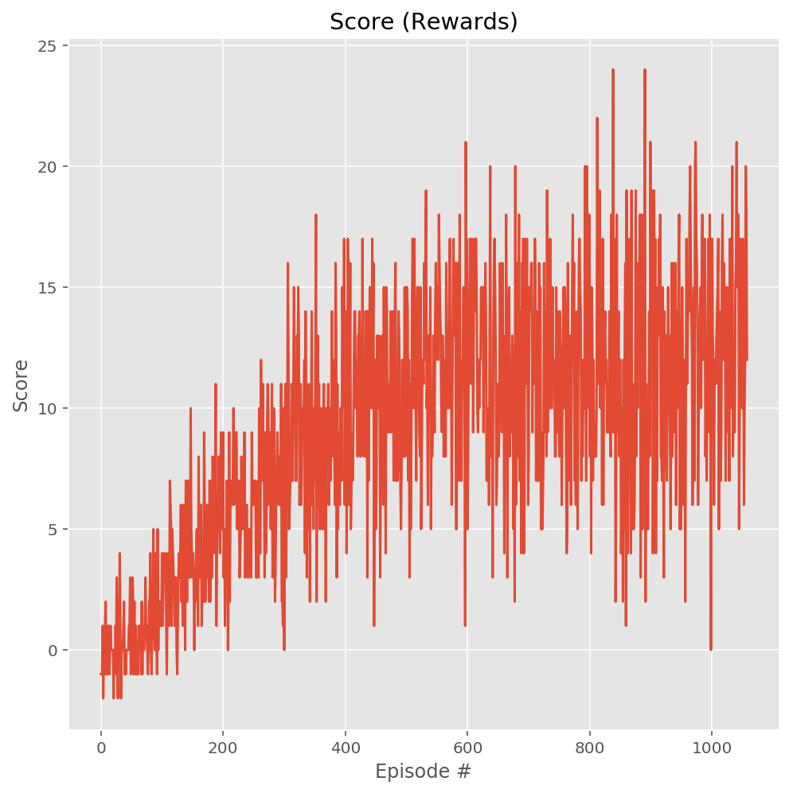

[//]: # (Image References)

[image1]: https://user-images.githubusercontent.com/10624937/42135619-d90f2f28-7d12-11e8-8823-82b970a54d7e.gif "Trained Agent"

### Project Overview

For this project, you will train an agent to navigate (and collect bananas!) in a large, square world.

![Trained Agent][image1]

A reward of +1 is provided for collecting a yellow banana, and a reward of -1 is provided for collecting a blue banana. Thus, the goal of your agent is to collect as many yellow bananas as possible while avoiding blue bananas.

The state space has 37 dimensions and contains the agent's velocity, along with ray-based perception of objects around the agent's forward direction. Given this information, the agent has to learn how to best select actions. Four discrete actions are available, corresponding to:

0 - move forward.

1 - move backward.

2 - turn left.

3 - turn right.

The task is episodic, and in order to solve the environment, your agent must get an average score of +13 over 100 consecutive episodes.

### Algorithm

### Submissions

When you are ready to submit your project, collect the following files and compress them into a single zip archive for upload:

- Navigation.ipynb
  file with fully functional code. It examine the state and action space, take random actions in the environment, train an agent using DQN and plot the scores.
  
- model.py
    It implements a regular fully connected DNN PyTorch QNetwork class. It was trained to predict the action based on the states. 
    The NeuralNetwork is used by DQN. The structure is,
    The input layer passed by the caller, followed by 2 hidden fully connected layers of 1024 cells each. The output layer decided by the caller as well.
    
- dqn_agent.py
    A DQN agent and replay buffer momory used by the DQN agent
    Agent class interacts with and learns from the environment. step() function stores the steps taken by the agent into the Replay buffer. Learn every 4 time steps. If enough samples are available in memory, get random subset and learn. act() returns actions for given state as per current policy. The learn() function update value parameters using given batch of experience tuples. The soft_update() function soft update model parameters. 
    The ReplayBuffer class is a fixed-size buffer to store experience tuples.
    
- README.md markdown file with a description of the code.

- An HTML or PDF export of the project report with the name Report.html or Report.pdf.

- A file with the saved model weights of the successful agent, can be named something like model.pt.

### DQN Settings

BUFFER_SIZE = int(1e5)  # replay buffer size

BATCH_SIZE = 64         # minibatch size

GAMMA = 0.99            # discount factor

TAU = 1e-3              # for soft update of target parameters

LR = 5e-4               # learning rate 

UPDATE_EVERY = 4        # how often to update the network

### Result

Episode 10 	 Average Score: -0.30

Episode 20 	 Average Score: -0.05

Episode 30 	 Average Score: -0.07

Episode 40 	 Average Score: 0.10

Episode 50 	 Average Score: 0.14

...

Episode 140 	 Average Score: 1.69

...

Episode 290 	 Average Score: 6.15

...

Episode 460 	 Average Score: 9.92

Episode 870 	 Average Score: 11.36

Episode 880 	 Average Score: 11.24

Episode 890 	 Average Score: 11.27

Episode 900 	 Average Score: 11.00

Episode 910 	 Average Score: 11.29

Episode 920 	 Average Score: 11.18

Episode 930 	 Average Score: 11.07

...

Episode 1020 	 Average Score: 12.07

Episode 1030 	 Average Score: 12.33

Episode 1040 	 Average Score: 12.49

Episode 1050 	 Average Score: 12.73

Environment solved in 958 episodes! 	 Average Score: 13.00

Total Training Time = 23.5 min

The result satisfied the requirement of the project: 
"A plot of rewards per episode is included to illustrate that the agent is able to receive an average reward (over 100 episodes) of at least +13. The submission reports the number of episodes needed to solve the environment."
